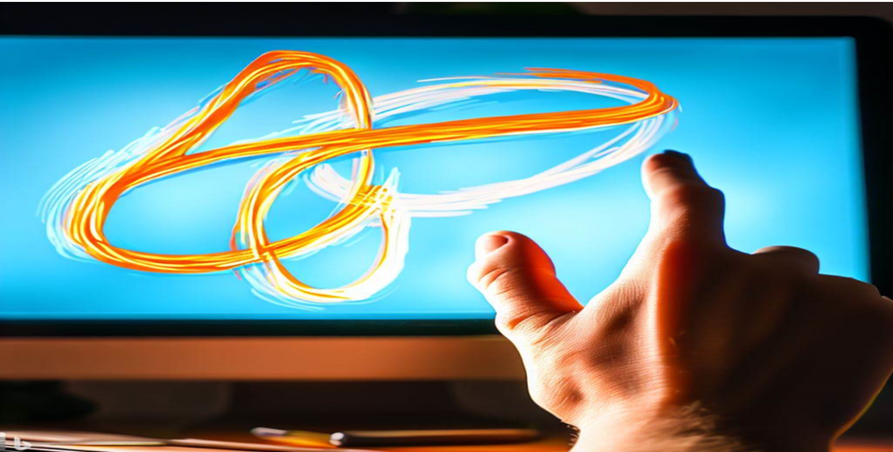

# 🎨 Hand-Sketch

HandSketch is a program that allows you to draw on a virtual whiteboard using your hand as a brush. The program uses a camera to detect the position of your hand and tracks the movement of your fingers to draw lines of different colors and sizes.



✨ Features
- Hand gesture recognition for drawing
- Virtual Whiteboard to draw
- Customizable brush sizes and colors
- Eraser tool
- Clear canvas button
- Color palette with random color option
- Dynamic color preview on pen button
- User-friendly GUI

## 💻 Tech Stack
- Python 
- OpenCV (used for video capture and image processing)
- Mediapipe (used for hand detection and tracking)
- NumPy (used for creating the canvas for drawing)

## 🔴 Demo 
https://github.com/VISHRUT225/Hand-Sketch/raw/main/images/Demo/demo.mp4


## :key: Prerequisites
1. You should install python version 3.7 or more

## 🚀 Getting Started

To get started with this project, simply download this repository and open with any IDE.

Change your directory to the cloned repository

```bash
  $ cd Flavor-Fusion
```

Create a virtual environment 
```bash
  $ python -m venv venv_name
```

Activate the new virtual environment venv
```bash
  $ .\venv\Scripts\activate
```

install required Libraries
```bash
  $ pip install -r requirements.txt
```

now you can run the project
```bash
  $ python main.py
```

## 🎞 Sample output:


## 🤝🏻 Contributing

Contributions are welcome! If you find any issues or would like to suggest an improvement, please create a new issue or pull request.

